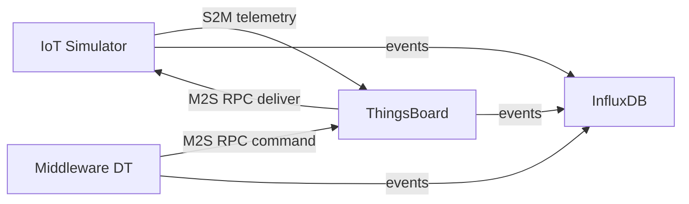

# Cenario Condominio

Testbed para avaliacao de latencia bidirecional em IoT condominial, com foco em URLLC, eMBB e Best-Effort.

## Definicao do cenario e metodologia

Execucao de referencia atual:

- Suite completa com 7 cenarios
- Duracao por cenario: 600 s
- Comando: ./scripts/run_scenario_suite.sh --duration 600 --m2s-perf
- Pacote de resultados unificado: results/marco-2026-03-13

### Entidades do teste

- IoT Simulator: gera telemetria, recebe comandos RPC e responde eventos.
- ThingsBoard: broker de telemetria e RPC entre dispositivos e middleware.
- Middleware DT: logica de Digital Twin e emissao de comandos M2S.
- InfluxDB: armazenamento das series para pos-processamento.
- Topologia/Containernet: emulacao de rede e aplicacao de perfil URLLC, eMBB e Best-Effort.

### Arquitetura do teste



### Como a metodologia foi aplicada

1. A suite executa os 7 cenarios em sequencia, no mesmo run folder.
2. Cada cenario sobe topologia limpa, executa carga por 600 s e exporta CSVs.
3. O pos-processamento usa correlation_id para M2S e matching FIFO por sensor para S2M.
4. As tabelas abaixo foram geradas somente com os artefatos de results/marco-2026-03-13.

## Metricas do teste

### Siglas e contexto

- URLLC: Ultra-Reliable Low-Latency Communications.
- eMBB: enhanced Mobile Broadband.
- S2M: Sensor to Middleware.
- M2S: Middleware to Sensor.
- AoT: Age of Twin.

### Definicao das metricas

- Delivery: percentual de comandos M2S com resposta ate 2000 ms no relatorio de correlacao.
- Mean, P50, P95, P99: media e percentis de latencia em ms.
- Jitter: variacao de latencia; neste repositorio a dispersao operacional e representada por CV.
- CV: coeficiente de variacao em percentual, CV = (desvio_padrao / media) x 100.
- AoT Mean: media de latencia M2S observada no Digital Twin.
- Twin Fidelity: percentual de comandos M2S que tiveram pareamento comando-resposta (matching por correlation_id, janela eventual do pos-processamento).

### Como calculamos no cenario de teste

- M2S: comando emitido pelo middleware e resposta recebida no simulador sao pareados por correlation_id.
- S2M: envio e recebimento de telemetria sao pareados por sensor em ordem FIFO.
- Delivery (tabela comparativa): usa corte de 2000 ms do relatorio de correlacao.
- Twin Fidelity: usa pares M2S efetivamente casados no pos-processamento (pode divergir do Delivery quando ha resposta tardia).

## Resultados

Fonte unica desta secao: results/marco-2026-03-13

Arquivos textuais (summaries, latency analysis, correlations) estao disponiveis diretamente. Os CSVs brutos estao compactados em results/marco-2026-03-13/data.tar.gz.

### Tabela 1 - Contexto completo (S2M + M2S)

| Cenario | S2M | M2S Sent | M2S Recv | Delivery | M2S Mean | M2S P95 | CV |
|---|---:|---:|---:|---:|---:|---:|---:|
| URLLC Otimizado (150ms) | 32957 | 1521 | 1522 | 100.00% | 303.7 ms | 352 ms | 11.97% |
| eMBB Otimizado (300ms) | 4256 | 101 | 15 | 0.00% | 3991.5 ms | 6095 ms | 23.09% |
| Best-Effort Otimizado (500ms) | 0 | 65 | 15 | 0.00% | 6928.5 ms | 9589 ms | 18.86% |
| URLLC RAW (30000ms) | 33049 | 1549 | 1549 | 99.94% | 299.5 ms | 343 ms | 8.52% |
| eMBB RAW (5000ms) | 4205 | 102 | 20 | 0.00% | 3850.8 ms | 5976 ms | 21.33% |
| Best-Effort RAW (10000ms) | 0 | 64 | 14 | 0.00% | 6806.3 ms | 9223 ms | 15.55% |
| URLLC M2S Perf (220ms + fast mode) | 33607 | 1688 | 1689 | 100.00% | 266.9 ms | 303 ms | 8.21% |

### Tabela 2 - Resultado isolado S2M

| Cenario | S2M total | Mean | P50 | P95 | P99 | CV |
|---|---:|---:|---:|---:|---:|---:|
| URLLC Otimizado (150ms) | 32957 | 66.174 ms | 60 ms | 131 ms | 172 ms | 59.11% |
| eMBB Otimizado (300ms) | 4256 | 1075.330 ms | 702 ms | 3494 ms | 6903 ms | 111.61% |
| Best-Effort Otimizado (500ms) | 0 | 0.000 ms | 0 ms | 0 ms | 0 ms | 0.00% |
| URLLC RAW (30000ms) | 33049 | 65.432 ms | 60 ms | 129 ms | 163 ms | 57.29% |
| eMBB RAW (5000ms) | 4205 | 1123.132 ms | 672 ms | 4563 ms | 9370 ms | 139.24% |
| Best-Effort RAW (10000ms) | 0 | 0.000 ms | 0 ms | 0 ms | 0 ms | 0.00% |
| URLLC M2S Perf (220ms + fast mode) | 33607 | 62.785 ms | 57 ms | 125 ms | 153 ms | 57.27% |

### Tabela 3 - Resultado isolado M2S

| Cenario | Sent | Recv | Delivery <=2000ms | Mean | P50 | P95 | P99 | CV | AoT Mean | Twin Fidelity |
|---|---:|---:|---:|---:|---:|---:|---:|---:|---:|---:|
| URLLC Otimizado (150ms) | 1521 | 1522 | 100.00% | 303.667 ms | 300 ms | 352 ms | 448 ms | 11.97% | 303.667 ms | 100.00% |
| eMBB Otimizado (300ms) | 101 | 15 | 0.00% | 3991.467 ms | 3801 ms | 6095 ms | 6095 ms | 23.09% | 3991.467 ms | 14.85% |
| Best-Effort Otimizado (500ms) | 65 | 15 | 0.00% | 6928.533 ms | 6273 ms | 9589 ms | 9589 ms | 18.86% | 6928.533 ms | 23.08% |
| URLLC RAW (30000ms) | 1549 | 1549 | 99.94% | 299.541 ms | 298 ms | 343 ms | 367 ms | 8.52% | 299.541 ms | 99.94% |
| eMBB RAW (5000ms) | 102 | 20 | 0.00% | 3850.750 ms | 3753 ms | 5976 ms | 5976 ms | 21.33% | 3850.750 ms | 19.61% |
| Best-Effort RAW (10000ms) | 64 | 14 | 0.00% | 6806.286 ms | 6452 ms | 9223 ms | 9223 ms | 15.55% | 6806.286 ms | 21.88% |
| URLLC M2S Perf (220ms + fast mode) | 1688 | 1689 | 100.00% | 266.935 ms | 265 ms | 303 ms | 323 ms | 8.21% | 266.935 ms | 100.00% |

### Leitura objetiva dos resultados

- URLLC manteve alta confiabilidade e menor latencia no cenario 7.
- eMBB e Best-Effort continuam com resposta M2S majoritariamente acima de 2000 ms.
- Cenario 7 e o melhor ponto atual para M2S no perfil URLLC (menor Mean, P95 e CV).

## Manual de uso do testbed

### Ordem exata para reproducao

1. Preparar ambiente e dependencias.

```bash
make setup
./scripts/setup_venv.sh
. .venv-reports/bin/activate
```

2. (Opcional) Rebuild das imagens quando houver mudanca em Dockerfile/servicos.

```bash
make build-images
```

3. Executar suite completa oficial com 7 cenarios.

```bash
./scripts/run_scenario_suite.sh --duration 600 --m2s-perf
```

4. Validar se o run folder tem os 7 resumos.

```bash
ls outputs/tests_YYYYMMDD_HHMMSS/test_*_summary.txt
```

5. (Opcional) Rodar somente cenario 7 para regressao rapida de URLLC.

```bash
./scripts/run_scenario_suite.sh --duration 600 --test 7
```

### Comandos auxiliares

```bash
make clean
make clean-containers
make reset-db
```

## Proximo passo planejado

Backups versionados de ThingsBoard, Middleware DT, Simuladores, Neo4j e InfluxDB serao adicionados em etapa posterior, junto com comando unico para recriar o cenario de reproducao para revisores.
